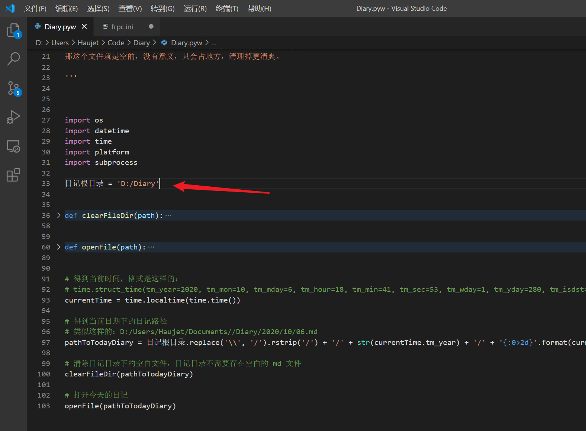
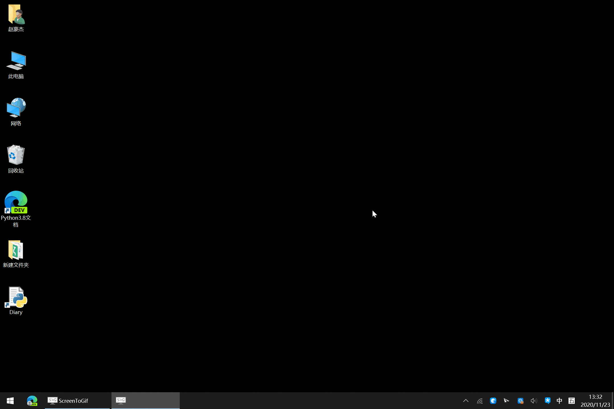
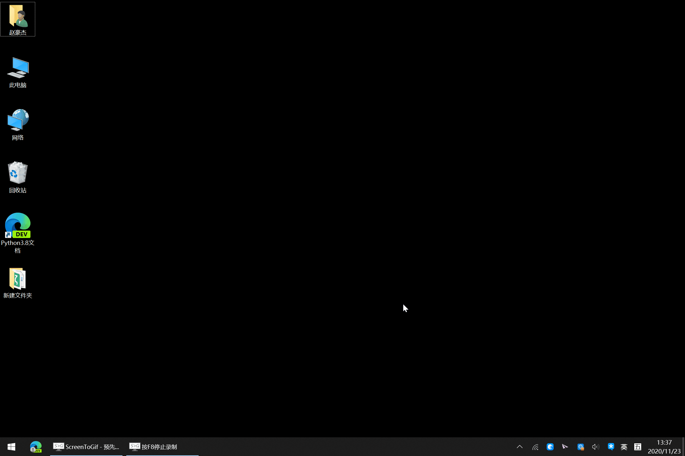

[中文](README.md)　|　[English](README_en.md)

[Gitee](https://gitee.com/haujet/Diary)　|　[Github](

#  Diary

> 更新日期：2020 年 11 月 23 日

## 🚩 简介

Diary，是我做的一个简单的 python 脚本，它只有一个功能：

打开今天的 md 日记。运行这个脚本，脚本会根据当前的日期，在日记本根目录下创建对应的年文件夹、月文件夹，然后新建一个今天日期的 md 文件，并且打开它。

## 🔮 使用方式

这是一个 python 脚本，将 `Diary.pyw` 下载下来，下载安装 python 后，双击脚本就可以运行。

下载 `Diary.pyw` 后，首先用文本编辑器编辑脚本，在下面设定一个日记本根目录：

然后运行这个脚本，脚本会根据当前的日期，在日记本根目录下创建对应的年文件夹、月文件夹，然后新建一个今天日期的 md 文件，并且打开它。

比如你设置的笔记本根目录是 `D:/Diary` ，今天是 2020 年 11 月 5 日，那么在运行此脚本后，会自动创建 `D:/Diary/2020/11/05.md` 文件，并且会打开它，如果你电脑装的有 Typora 等 Markdown 编辑器，就会用默认的 md 编辑器打开，这就是今天的日记，每天只有这一个日期命名的文件，每日一记。

另外，在打开今天的日记之前，还会清理日记文件夹下所有的空白文件，例如你昨天运行了脚本，打开了 04.md，但是什么都没写，就关闭了，那这个文件就是空的，没有意义，只会占地方，清理掉更清爽。

使用 Markdown 记笔记，可以方便地排版，插入图片、附件也方便，md 纯文本格式也不担心兼容问题。我在 Typora 中设置了粘贴图片时自动复制到 `assets` 目录以相对路径引用，这样，整个日记文件夹就可以方便地同步到其它设备。

你可以给这个脚本创建一个快捷方式，下面看下快捷方式运行效果的动图：

你还可以把这个快捷方式放在环境变量的路径中，就可以用 Win + r 的方式快捷启动，看效果：

## 🧾 附言

日记的多设备同步，可以选择坚果云、百度云、OneDrive 等网盘方案，如果不信任网盘，可以使用 [Syncthing](https://github.com/syncthing/syncthing) 这样的点对点多设备同步软件。

如果在同步方面还是有疑虑，希望将日记加密，可以使用我的另一个工具：[RcloneVault](https://gitee.com/haujet/RcloneVault) ，就可以将笔记文件夹透明地进行实时加密，网盘只用于同步加密后的文件。

## ☕ 打赏

万水千山总是情，一块几块都是情。本软件完全开源，用爱发电，如果你愿意，可以以打赏的方式支持我一下：

 

## 😀 交流

如果有软件方面的反馈可以提交 issues，或者加入 QQ 群：[1146626791](https://qm.qq.com/cgi-bin/qm/qr?k=DgiFh5cclAElnELH4mOxqWUBxReyEVpm&jump_from=webapi) 

