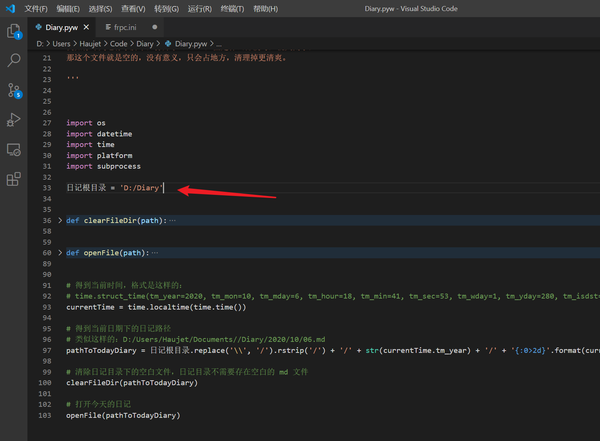
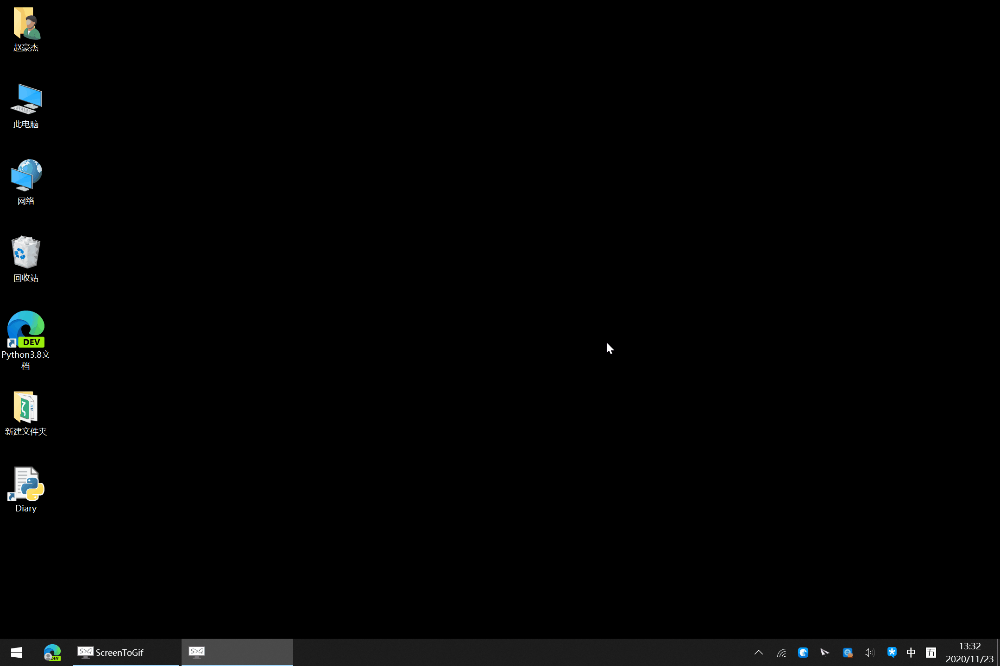
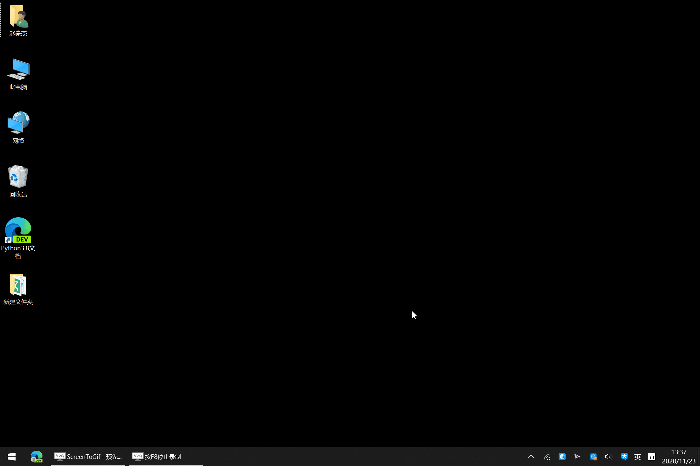

[中文](README.md)　|　[English](README_en.md)

[Gitee](https://gitee.com/haujet/Diary)　|　[Github](https://github.com/HaujetZhao/Diary)

#  Diary

> Update date：2020/11/23 

## 🚩 Introduce

Diary, is a simple python script I made with only one function: 

Opening today's md diary. Simply run this script, it will base on the date, creating corospondent year, month folders, and then create a md file of today's date, then it'll open this md file. 

This is a python script, download `Diary.pyw` first, after intalling python, you can directly doulbe click the script to run. 

After downloading `Diary.pyw` , first edit the script, set a diary root folder path: 

Then you can run the script, it will base on the date, creating corospondent year, month folders, and then create a md file of today's date, then it'll open this md file. 

For example, let's say you have set the diary root path `D:/Diary`, after runing this script, it will automaticlly create   `D:/Diary/2020/11/05.md` file, and then open it. If you have a Markdown editor like Typora installed, the md will be opened with default md editor. That is today's diary, one diary file per one day. 

Besides, before opening today's diary, it will also automaticlly clean the blank files under the diary folder. Let's say you ran the script yesterday, and created a `04.md`, but you closed it without writing any thing, it will be deleted since it's empty and meaningless. 

Using markdown to write diary, you can conviniently composing, insert images and files, and you won't worry about compatibility problems that other diary apps have, because md is totally plain text! 

In Typora, I set the images to be auto copied to the `assets` folder using relative path to refer to. I also recommand you doing this, so that you can easily sync your diary folder to other devices without breaks the image and file links. 

You can create a shortcut link in your desktop, the gif below shows the effects: 

You can also add this shortcut link to a system environment path, so that you can run it with `Win + r` shortcut: 

## 🧾 Append

As for sync between devices, I suggest you cloud disk vendors like OneDrive or Google Drive, if you don't trust these cloud disk vendors, you can also use open source p2p sync softwares like  [Syncthing](https://github.com/syncthing/syncthing) . 

If you still worries about the diary file safety, wishing to encrypt the diary, you can check out my another tool [RcloneVault](https://github.com/HaujetZhao/RcloneVault) , it uses rclone to encrypt the folders transparently in almost realtime, you can only sync the encrypted folder, users can only read the contents after inputing the correct password. 

## ☕ Sponsor

If you'd like, you can tip me a bit, that would be a great help to me：

 

## 😀 Communicate

Any suggestions, you can create a issue，or joining my QQ group：[1146626791](https://qm.qq.com/cgi-bin/qm/qr?k=DgiFh5cclAElnELH4mOxqWUBxReyEVpm&jump_from=webapi) 

